# Engine Structure

## Graph of the whole Engine:

was not possible due to memory overflow when exporting  
¯\\_(ツ)_/¯

## Overview of the high level namespaces:

All the Namespaces and their Connections to each other
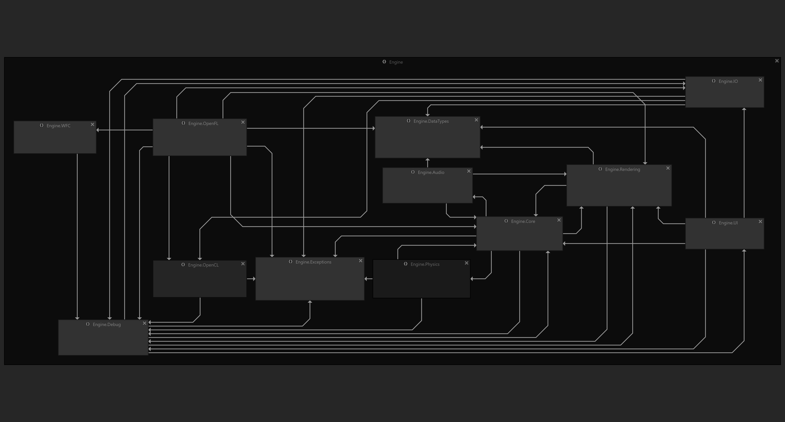

## Single Systems:

### Engine.Audio:
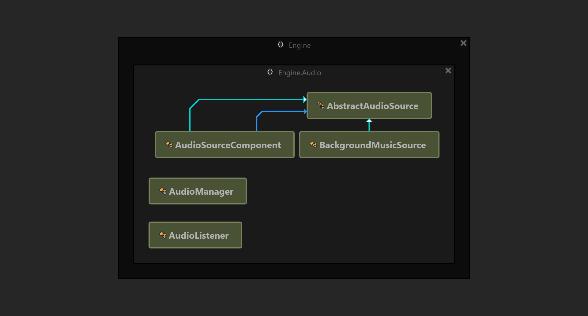

### Engine.Core:
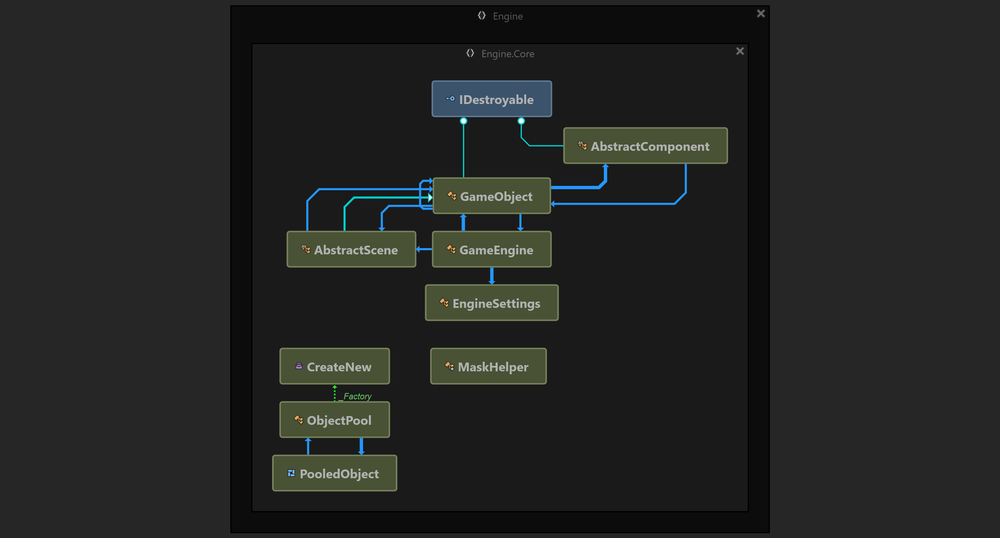

### Engine.DataTypes:
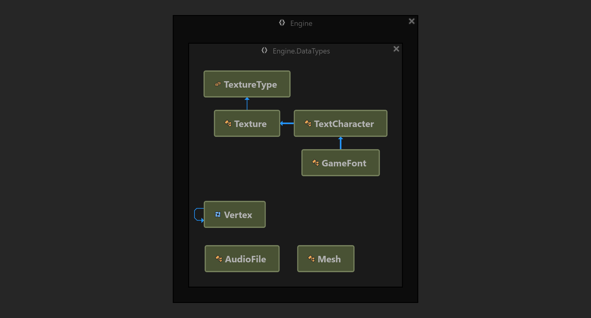

### Engine.Debug:
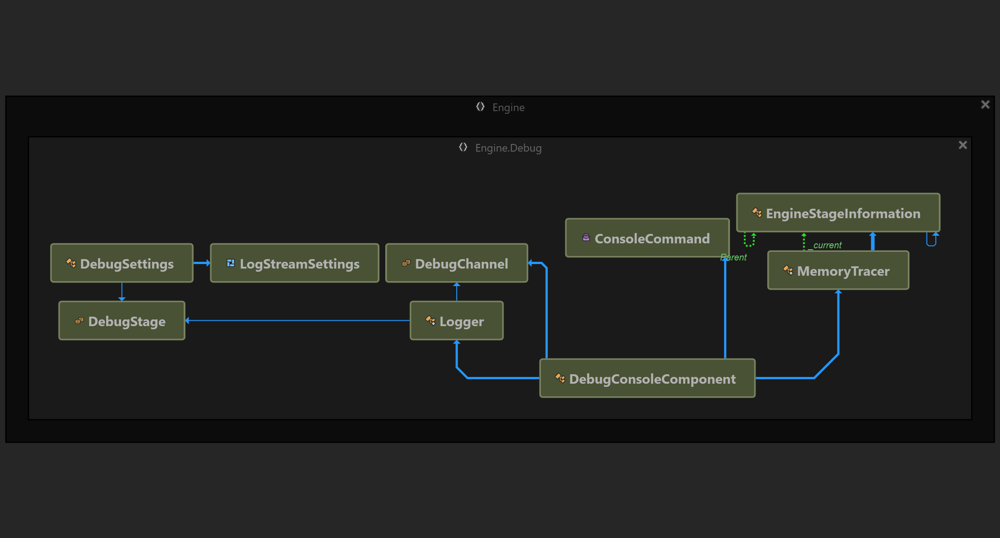

### Engine.Exceptions:
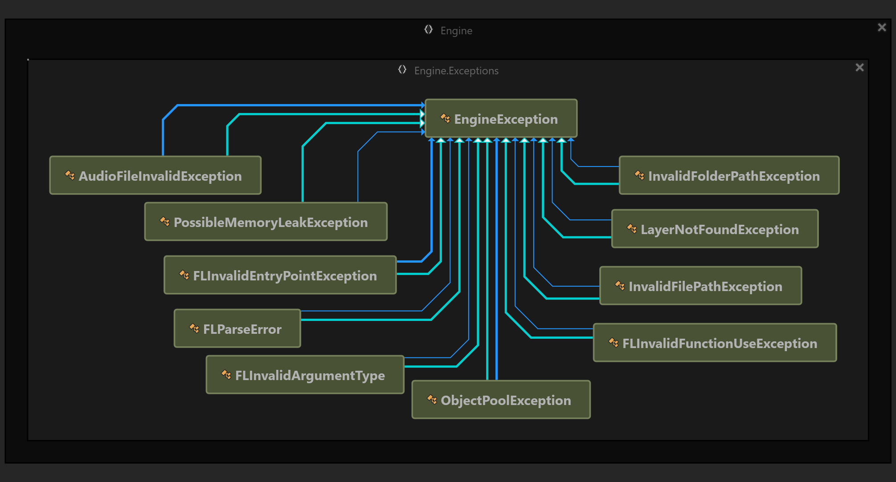

### Engine.IO:
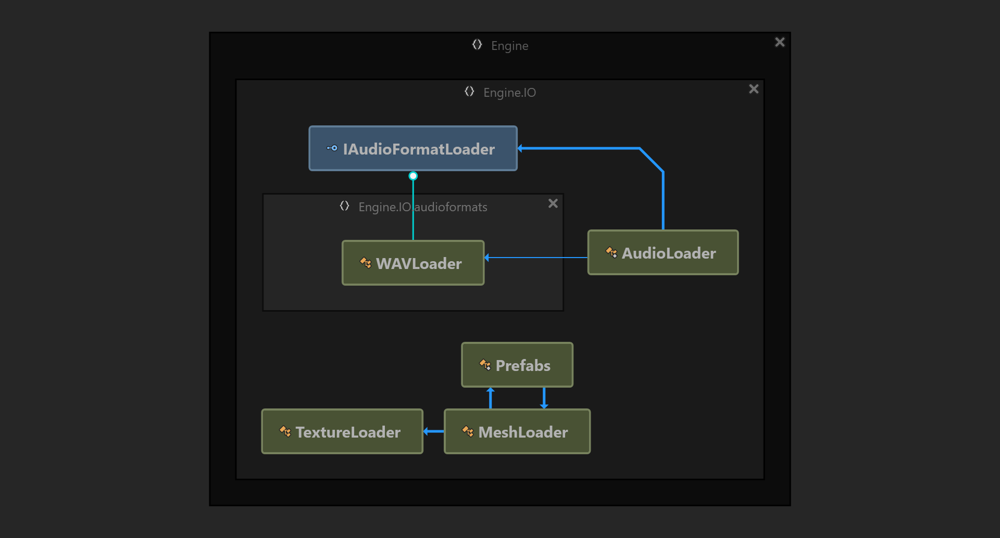

### Engine.OpenCL:

Note: The OpenCL Binding is embedded into the Engine.OpenCL.DotNetCore namespace and is not shown here.
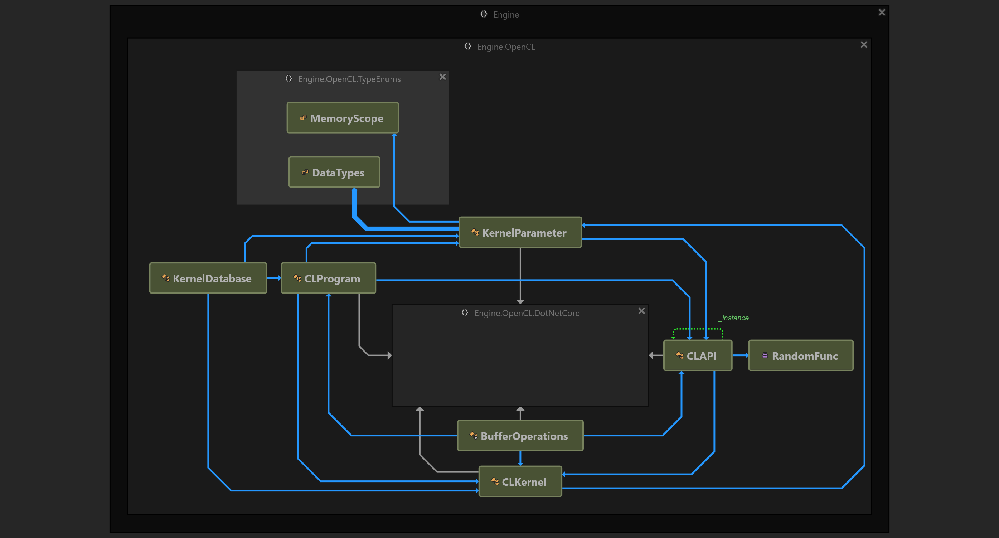

### Engine.OpenFL:
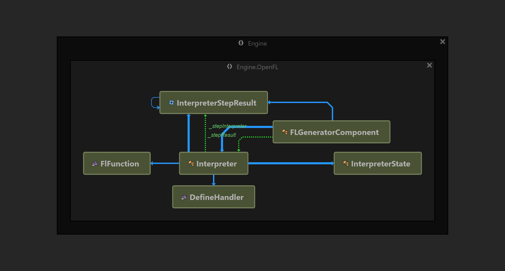

### Engine.Physics:

Note: The bepuphysics engine is embedded into the Engine.Physics.BEPU* namespaces and is not shown here.
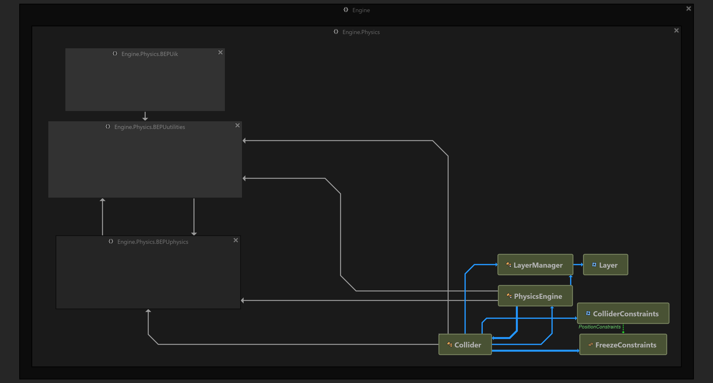

### Engine.Rendering:
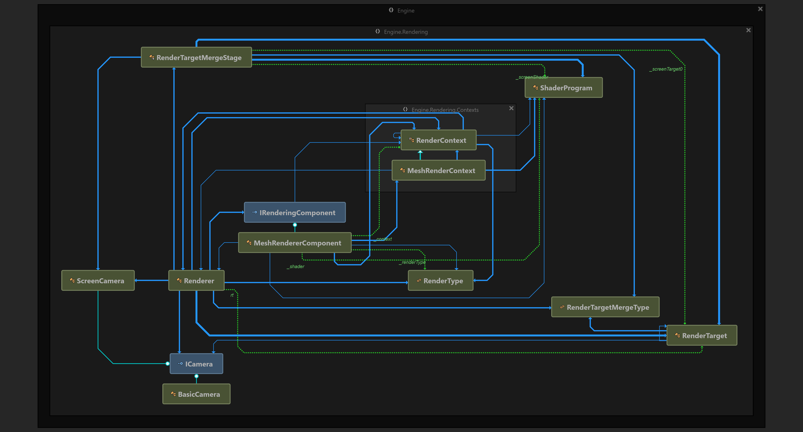

### Engine.UI:
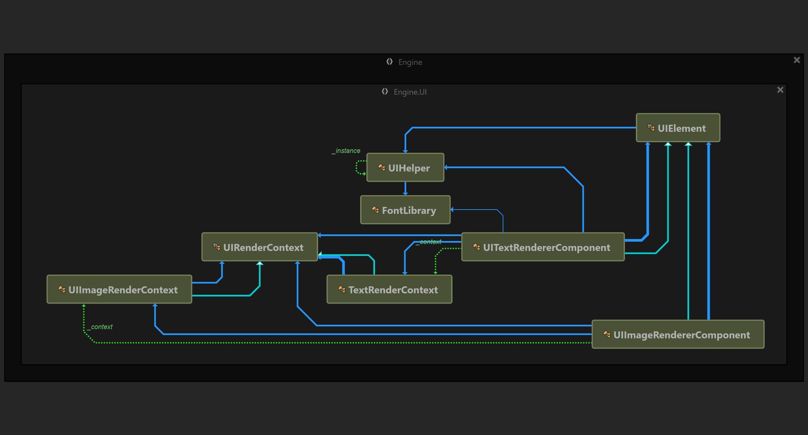

### Engine.WFC:
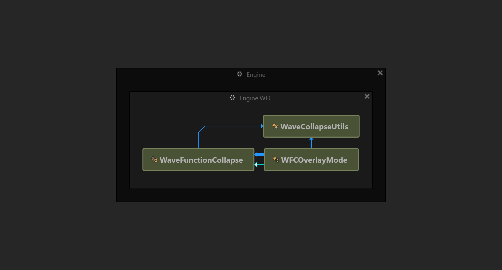
